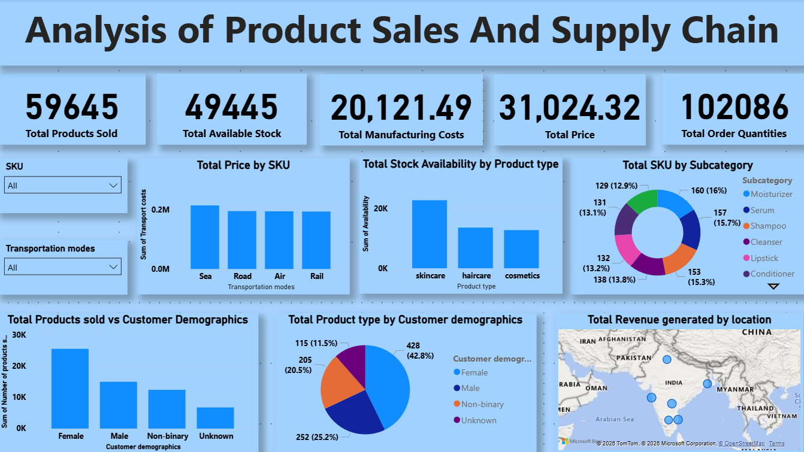

# 📊 Analysis of Product Sales and Supply Chain

## 📌 Overview
This project presents a comprehensive analysis of product sales and supply chain data using an interactive dashboard.  
It helps in understanding sales performance, stock availability, customer demographics, and revenue distribution.

The goal is to extract meaningful insights that can support business decision-making.

---

## 🚀 Features

- 📦 Total Products Sold Tracking
- 🏷️ SKU-wise Price Analysis
- 📊 Stock Availability by Product Type
- 🚚 Transportation Mode Analysis (Sea, Road, Air, Rail)
- 👥 Customer Demographics Insights
- 📍 Revenue Distribution by Location
- 🧾 Subcategory-wise SKU Distribution
- 💰 Manufacturing Cost vs Revenue Analysis

---

## 📷 Dashboard Preview

> Make sure to upload your screenshot inside an `assets` folder and name it `dashboard.png`

---

## 🛠️ Tech Stack

- **Power BI (.pbix)** – Dashboard creation
- **Excel (.xlsx)** – Data preprocessing
- **Data Visualization Techniques**
  - Bar Charts
  - Pie Charts
  - Donut Charts
  - Maps

---

## 📊 Key Insights

- Skincare products have the highest stock availability.
- Sea transport contributes the most to transportation costs.
- Female customers dominate product purchases.
- Revenue is concentrated in specific geographic regions.
- Certain subcategories like Moisturizer and Serum have higher SKU counts.

---

## ⭐ Support

If you found this project useful:
- ⭐ Star the repository
- 🍴 Fork it
- 📢 Share it

---
